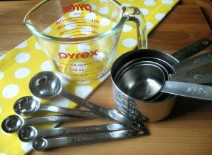

## ESLint

 
In a “Introduction to software engineering” class I have been introduced to coding standards, specifically eslint for javascript. 
I feel that most errors are trivial and that these standards are just another red tape blocking coders for unknown reasons. For instance, 
the error that is concerned with spacing between a parenthesis and a bracket for objects or arrays. I believe 
that this entire process could be more effective if automated. Being that I have never used a coding standard I had developed my
own personal habits which I have stuck with since I started. 

## Old Habits

From this shallow experience with coding standards, I have this impression that coding standards are similar to any other standard, but 
specifically in the culinary sense. When I first started cooking I didn’t really follow a recipe by the measurements; just as I would code
based on examples I’ve seen in class. And being that each class would have a different teacher, my individual coding style would naturally
evolve over time. I didn’t use any measuring cups or weight out ingredients on a food scale, rather I felt confident in just eye-balling 
amounts of both ingredients and time. The resulting product was satisfactory to say the least, just like with my code the food wasn’t the
best it could be, but to me it accomplished its purpose; it was edible. 

## Readability

This is fine for home consumption, being that the chef must eat his own cooking, but to not hold up a standard for commercial consumption is
just irresponsible. As I continued to learn about what coding standards are in place for; it only made sense to adopt a standard that your
team would utilize. Especially in a gigantic tech company where there can be hundreds of other programmers and engineers that will at many 
occasions be sharing code. If these files are not served up with some rules to dictate what a reader should expect then it will be detrimental 
to any project. Let’s say a customer orders a steak and they enjoyed it so much that they glutinously order a second helping. If the steak 
isn’t up to the same standard then the customer will be severely dissatisfied. 

All in all, as a student developer, I found in the past that my code could be a bit cumbersome to reread and understand, even though I was 
the one who wrote it. For this reason, to keep code readability high, I appreciate the purpose of coding standards greatly. Although It is not 
to say that I like them; with any habit, it takes a bit of grit to step out of your old habits to adopt a new one. And at this moment in time 
achieving a green check mark from eslint is just another frustration to bear.
