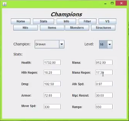

## 1) The Project
<hr>
In 2016 North America alone had 200 million people fighting, constructing, and driving in video games.
Looking For Game was a project to help strength the gaming community at the Univeristy of Hawaii, because
playing video games maybe fun, but its tenfold having fun with friends. It was imagined to connect people that 
with each other that they would have otherwise had a slim chance of meeting. The Meteor application holds 
profiles of its users in a Mongo database and indexes them on the games they play.



## 2) What's Your Role 
<hr>
The roles of this project were not rigidly defined; this in part is due to the environment of the development.
What I mean by this is that this project was officially for a software engineering project and this was a final
project idea. Each team member should to have their hand in every part of the project in the unfortunately event
of a team member not pulling their weight. Fortunately this was not the case for this project. What I had done specifically
was help with implementing the design of the search page, routing parts of the website, adding to schema design and so on.

```
String url = "jdbc:mysql://192.254.189.7:3306/vpawid_321project";
               Class.forName ("com.mysql.jdbc.Driver");
               conn =DriverManager.getConnection(url,"vpawid_test","ics321");
               System.out.println ("Database connection established");
                
               PreparedStatement statement = conn.prepareStatement("select 
Champion_name, Champion_id from Passives WHERE Champion_id > 100");
```

## 3) The Experience
<hr>
This was not my first time working with a team, but it was my first time working with a team that work cohesively. The
motivation and discipline of the team had a heavy impact on my own productivity, it also made working together fun. I 
contribute the team spirit to each team members cooperative attitude and the fact that we met multiple times a week; coding
on the same table. Github was used for version control and we did learn some important lessons about project management.
