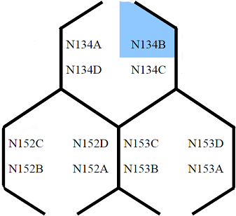
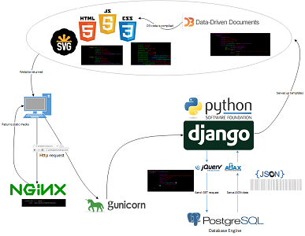

## 1) The Project

During the summer of 2015 I was fortunate enough to have an opportunity 
to intern at Hewlett Packard's Vancouver site in Washington State. There 
I worked under the R&D IT division to develop a Web application tool from 
the ground up. The tool was essentially a blueprint map of each pod (or 
more commonly known as cubical) and display each ethernet port 
information, but more importantly who is sitting there. I also 
implemented an efficient way to update the information, which was to 
submit a csv file to the server and it would refresh the database with 
the new data. This would speed up the responsiveness of the R&D IT team, 
because a problem that slowed down the process was locating all 
information per the specific employee.

## 2) What's Your Role

For this project, I had to wear many different hats. At first, I was a 
researcher looking for which technology would suit my problem and then 
studying to utilize these languages. I then switched hats to a DBA and 
struggled with how to implement a schema that would fit my solution. 
After that had been done the backend server which was a Django server 
hosted on Gunicorn and proxied by NGINX had been relatively straight 
forward. Lastly the difficult part was translating the data in the 
PostgreSql database to a visually interactive application. For this I 
turned to D3.js to draw and handle all the events of the front-end side 
of my application. Because the pods were not symmetrically placed out and 
were not 90 degree squares it was a real challenge. Fortuitously I added 
two columns to my tables and D3 would know which shape to draw and where 
according to which tuple it was reading.

## 3) The Experience

This was a very eye-opening experience to the realm of full stack 
development. Although I was the only developer on this application, I 
gained experience in communicating with a client, especially one was not 
overly familiar with the technology. Another important lesson I learned 
was that as a software engineer a great skill to have is to find the 
resources to solve a problem. At a big company, the best resource for a 
challenging problem is other engineers. The senior engineers have a 
wealth of knowledge. Learning the interpersonal skill to find mentors and 
colleagues will rapidly increase your growth.

