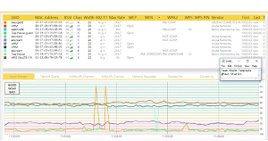

## The Project

My team and I tested the security of UH Manoa's wireless network.  Using 
our wireless computers, the team warwalked to different areas on campus 
in search of wireless access points.  We were in search of any open or 
unlocked access points that would allow connection to the internet 
without password protections.  Using different apps available to search 
for WiFi signals, we captured the numerous available signals within our 
proximity.  The data collected can help the CISO in creating policies 
that will protect against any wireless network vulnerabilities.   

	As a college campus, UH Manoa has a diverse population in size, 
color and age. It was easy to suspect that students would normally carry 
around computers and regularly work on them throughout campus; keeping 
this in mind we approached this experiment with the intent to blend in to 
the student population. Although the campus network is password protected, 
it wouldn't take a hacker much social engineering magic to acquire 
someone's credentials. Once on the network a broadcast type network 
scanner could be easily used to map the network.

	We had acquired information of several thousand devices and granted 
that most of these devices are computers that have dynamic IP addresses 
there were some other interesting finds. The Cisco routers for each 
building and every access point which is made by aruba were visible and 
so were their information. This is one of the first steps for a hacker; 
to know and understand which devices are up and where. Other devices that 
were up and open were many printers from various manufactures or personal 
smart phones.
	UH accounts can be hijacked, as it can be seen from many phishing 
email alerts every once in a while. If the compromised accounts are 
allowed to access networks, hackers can use them to break in the network 
device itself. If they can take over the network, they can obtain 
information from others who are also connected to the network.
## Recommendations

       It is recommended of the CISO to incorporate policies that will 
require the network and access points to the network be protected. 
Security requirements should include security programs and plans that are 
put in place for the protection of the system. Risk assessments need to 
be performed on a regular basis to maintain security of the system. 
Detailed assessments should be performed on high impact systems and 
regular assessments should be performed on lower impact systems. Security 
controls should be consistent with the security architecture implemented 
for the system. 
       This should involve maintaining rigorous user and password 
combinations for networks, routers, and other connected devices. Also, 
being able to discern access points from others to be sure where attacks 
are coming from. As a last resort, the CISO must be able to reset all 
routers and devices. It is the responsibility of the CISO to implement 
the policies created to protect the wireless network against any 
vulnerabilities.

